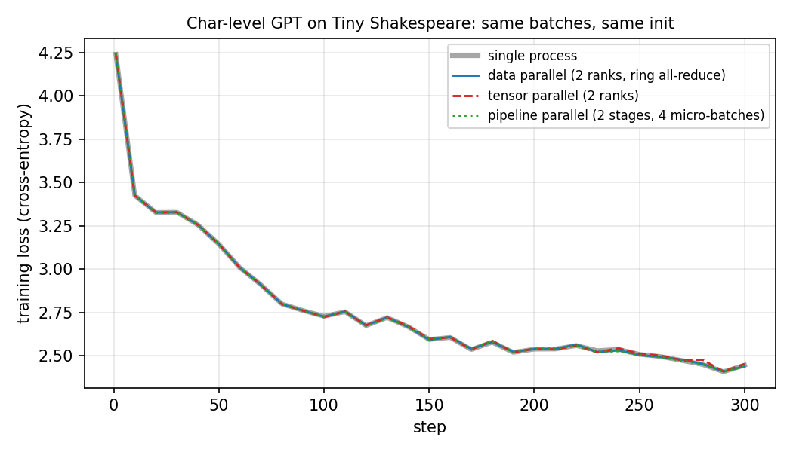

# TinyTrain

Data, tensor and pipeline parallelism for GPT training, written from scratch on top of
`torch.distributed` point-to-point and collective ops. The goal is to make each strategy small
enough to read in one sitting, and to prove each one computes exactly what single-process
training computes.



A 4-layer character-level GPT trained on Tiny Shakespeare with each strategy, from the same
initial weights on the same batches (2 CPU ranks, gloo). The curves agree to within 6e-5 for the
first 50 steps and stay together afterwards; the small late drift is floating-point summation
order compounding through Adam.

## What is inside

| Piece | File | How it works |
|---|---|---|
| Ring all-reduce | `distributed/ring_allreduce.py` | reduce-scatter then all-gather over N-1 steps each, using `isend`/`irecv` to the ring neighbours; each rank sends 2(N-1)/N of the data |
| Data parallel | `distributed/data_parallel.py` | parameters broadcast from rank 0; gradients averaged in ~25 MB buckets with the ring (or the backend's all-reduce); `no_sync()` for gradient accumulation |
| Tensor parallel | `distributed/tensor_parallel.py` | Megatron-style: MLP split column→row, attention split by heads; `copy_to_tp` (identity forward, all-reduce backward) and `reduce_from_tp` (all-reduce forward, identity backward) carry all communication |
| Pipeline parallel | `distributed/pipeline_parallel.py` | GPipe schedule across processes: all micro-batch forwards (activations sent rank to rank), then all backwards (gradients sent back); the tied embedding / LM head gradient is summed between the first and last stage |
| Mixed precision | `training/mixed_precision.py`, `training/trainer.py` | autocast (fp16 on CUDA, bf16 on CPU), dynamic loss scaling for fp16: unscale, skip the step and back off on overflow, grow after a run of good steps |
| Gradient checkpointing | `training/gradient_checkpoint.py` | recompute block activations in backward |

## Correctness tests

`pytest -q` runs 42 tests, including multi-process ones that start real gloo process groups on
CPU and compare against a single-process reference:

- ring all-reduce equals `dist.all_reduce` for 2, 3 and 4 ranks, including tensors smaller than
  the number of ranks;
- data parallel (ring and backend all-reduce): every rank's gradients equal the full-batch
  gradients, and replicas stay identical;
- tensor parallel: same loss as the full model, each rank's weight gradients equal the matching
  shard of the full gradient, replicated parameters get the full gradient;
- GPipe with 2 stages x 4 micro-batches and 4 stages x 2 micro-batches: same loss and the same
  gradients as the full model, including the tied embedding;
- gradient checkpointing gives identical gradients; loss scaling unscales exactly and skips
  updates on overflow.

## Run it

```bash
pip install -e ".[dev]"
pytest -q

python scripts/train_parallel.py --strategy single
torchrun --nproc_per_node=2 scripts/train_parallel.py --strategy dp
torchrun --nproc_per_node=2 scripts/train_parallel.py --strategy tp
torchrun --nproc_per_node=2 scripts/train_parallel.py --strategy pp --micro-batches 4
```

On Linux CPU-only machines set `GLOO_SOCKET_IFNAME=lo` if gloo cannot pick a network interface.
On GPUs the script uses NCCL.

## Limitations

- The GPipe schedule keeps every micro-batch's activations until the backward phase; a 1F1B
  schedule would bound that memory.
- Tensor and pipeline parallelism are not combined with data parallelism (no 2D/3D process
  groups), and communication is not overlapped with computation.
- Measured on CPU only; the numbers above are about correctness, not speed.

MIT License.
